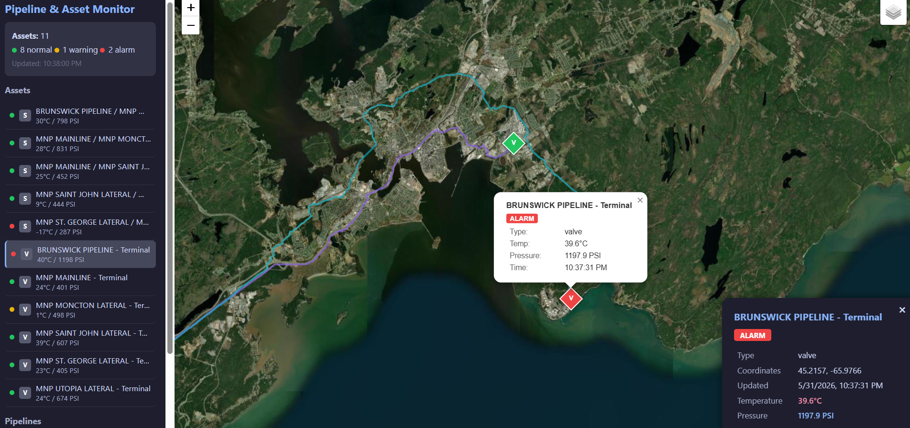
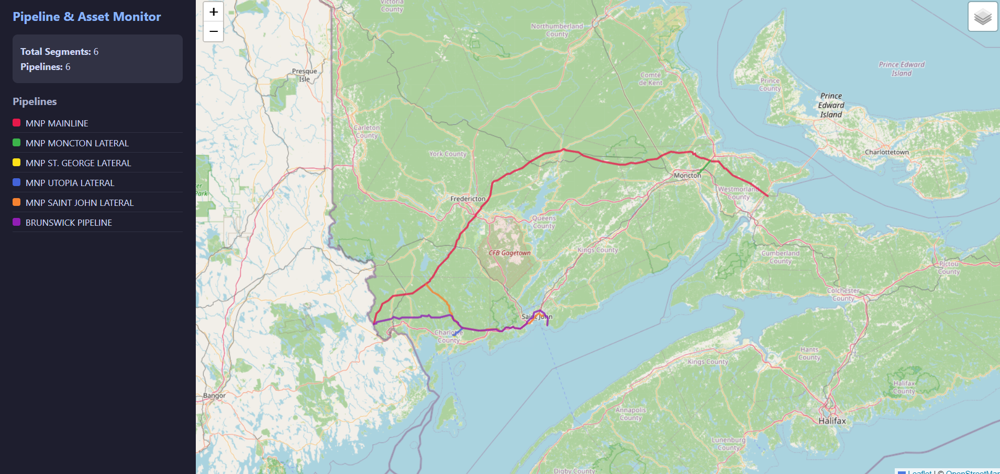

# Pipeline & Asset Monitor

An interactive web dashboard that visualises Canadian oil and gas pipeline infrastructure — including pipeline routes, valve stations, and sensor nodes — with **simulated real-time telemetry** (temperature, pressure, status).

The project demonstrates a complete **data pipeline → REST API → map frontend** architecture using Python, C# / .NET, and React.

---

## Key Features

- **Interactive Map** — Leaflet-based map with OpenStreetMap / satellite tiles, displaying pipeline GeoJSON routes colour-coded by pipeline name.
- **Asset Markers** — Valve and sensor nodes are placed at pipeline terminals and intersections. Each marker shows live status via colour: green (normal), yellow (warning), red (alarm).
- **Real-Time Telemetry** — Temperature and pressure readings update every 10 seconds (frontend polling API). Tapping a marker reveals an info popup and a detail panel.
- **Data Simulation** — A Python ETL pipeline generates realistic temperature/pressure data using a random-walk model and persists it to SQL Server.
- **Dagster Orchestration** — The ETL pipeline is wrapped in Dagster assets with an optional per-minute schedule, giving you a web UI to monitor and trigger runs.
- **RESTful API** — ASP.NET Core provides `GET /api/assets`, `/api/assets/{id}/readings`, and `/api/assets/{id}/history` endpoints backed by Entity Framework Core.

---
## Example



---

## Architecture

```
┌──────────────────────────────────────────────────────┐
│  React + Leaflet        ←  port 3000                 │
│  (Vite dev server, proxies /api → :5000)             │
└──────────────┬───────────────────────────────────────┘
               │  GET /api/assets
               ▼
┌──────────────────────────────────────────────────────┐
│  ASP.NET Core Web API    ←  port 5000                │
│  EF Core → SQL Server LocalDB                        │
└──────────────┬───────────────────────────────────────┘
               │  reads
               ▼
┌──────────────────────────────────────────────────────┐
│  SQL Server LocalDB                                  │
│  Database: PipelineDB                                │
│  Tables:  assets, readings                           │
└──────────────┬───────────────────────────────────────┘
               │  writes
               ▼
┌──────────────────────────────────────────────────────┐
│  Python ETL + Dagster    ←  port 3001 (Dagster UI)   │
│  • extract_nodes.py  – GeoJSON → asset definitions   │
│  • simulate.py       – random-walk data generator    │
│  • dagster_pipeline.py – scheduling & orchestration  │
└──────────────────────────────────────────────────────┘
```

---

## Tech Stack

| Layer | Technology |
|-------|-----------|
| Frontend | React 18, Leaflet (react-leaflet), Vite |
| Backend API | C# / ASP.NET Core 8, Entity Framework Core |
| Database | SQL Server (LocalDB for dev; also supports PostgreSQL) |
| Data Pipeline | Python 3, SQLAlchemy, pyodbc |
| Orchestration | Dagster |
| Map Data | GeoJSON (OpenStreetMap free tiles, Esri satellite) |

---

## Project Structure

```
├── backend/                    # C# ASP.NET Core Web API
│   ├── Controllers/
│   │   └── AssetsController.cs   # REST endpoints
│   ├── Data/
│   │   └── AppDbContext.cs       # EF Core DbContext
│   ├── Models/
│   │   ├── Asset.cs
│   │   └── Reading.cs
│   └── Program.cs
├── pipeline_etl/               # Python ETL + Dagster
│   ├── config.py                 # DB connection & settings
│   ├── models.py                 # SQLAlchemy ORM models
│   ├── extract_nodes.py          # GeoJSON → asset nodes
│   ├── simulate.py               # Data simulation
│   └── dagster_pipeline.py       # Dagster assets & schedule
├── src/                        # React frontend
│   ├── App.jsx                   # Root component (polling)
│   ├── MapView.jsx               # Map + markers + sidebar
│   └── index.css
├── public/
│   └── Pipelines.geojson         # Pipeline route data (static)
├── package.json                  # Node dependencies
└── vite.config.js                # Vite config + API proxy
```

---

## Prerequisites

- **Node.js** ≥ 18
- **.NET SDK** ≥ 8.0
- **Python** ≥ 3.11
- **SQL Server LocalDB** (included with Visual Studio or SQL Server Express)

Verify:

```bash
node --version
dotnet --version
python --version
sqllocaldb info
```

---

## Getting Started

All commands are run from the project root.

### 1. SQL Server

```bash
sqllocaldb start MSSQLLocalDB
```

The database `PipelineDB` is created automatically the first time the ETL runs.

### 2. Python ETL

```bash
# Create virtual environment (first time only)
python -m venv venv
source venv/Scripts/activate      # Windows Git Bash / WSL
# venv\Scripts\activate           # Windows CMD

# Install dependencies (first time only)
pip install -r pipeline_etl/requirements.txt
pip install pyodbc

# Seed asset definitions from GeoJSON (first time only)
python pipeline_etl/simulate.py seed

# Generate one round of readings
python pipeline_etl/simulate.py tick

# Or loop continuously every 60 seconds
python pipeline_etl/simulate.py run
```

### 3. Backend API

```bash
# Restore packages & run (port 5000)
dotnet run --project backend/Backend.csproj
```

Verify: open **http://localhost:5000/swagger**

### 4. Frontend

```bash
# Install dependencies (first time only)
npm install

# Start dev server (port 3000)
npm run dev
```

Open **http://localhost:3000** — the map loads pipeline routes and asset markers with live data.

### 5. Dagster (optional)

```bash
source venv/Scripts/activate

# Run on port 3001 (avoids conflict with frontend)
dagster dev -f pipeline_etl/dagster_pipeline.py --port 3001
```

Open **http://localhost:3001** — the Dagster UI lets you manually trigger assets or enable the per-minute schedule.

> **Note:** Set `DAGSTER_HOME` to a persistent directory to avoid temporary folders in the project root:
> ```bash
> export DAGSTER_HOME=./dagster_home
> ```

---

## Port Summary

| Service | Port | Command |
|---------|------|---------|
| Frontend (Vite) | 3000 | `npm run dev` |
| Dagster UI | 3001 | `dagster dev -f pipeline_etl/dagster_pipeline.py --port 3001` |
| Backend API | 5000 | `dotnet run --project backend/Backend.csproj` |
| SQL Server LocalDB | named pipe | `sqllocaldb start MSSQLLocalDB` |

---

## API Reference

All endpoints return JSON.

| Method | Path | Description |
|--------|------|-------------|
| `GET` | `/api/assets` | All assets with latest reading snapshot |
| `GET` | `/api/assets/{id}/readings?count=N` | Last N readings for an asset |
| `GET` | `/api/assets/{id}/history?limit=N` | Historical readings (ascending time) |

Example response (`/api/assets`):

```json
[
  {
    "id": 1,
    "name": "BRUNSWICK PIPELINE / MNP MAINLINE - Intersection",
    "type": "sensor",
    "longitude": -67.4346,
    "latitude": 45.2234,
    "status": "normal",
    "updatedAt": "2026-05-31T07:10:42.439926+00:00",
    "latestReading": {
      "temperature": 39.05,
      "pressure": 789.95,
      "timestamp": "2026-05-31T07:10:42.439926+00:00"
    }
  }
]
```

---

## Database Schema

### `assets`

| Column | Type | Description |
|--------|------|-------------|
| id | int (PK) | Auto-increment |
| name | nvarchar(200) | Pipeline name(s) + node type |
| type | nvarchar(50) | `sensor` (intersection) or `valve` (terminal) |
| longitude | float | WGS 84 |
| latitude | float | WGS 84 |
| status | nvarchar(20) | `normal` / `warning` / `alarm` |
| updated_at | datetimeoffset | Last reading timestamp |

### `readings`

| Column | Type | Description |
|--------|------|-------------|
| id | int (PK) | Auto-increment |
| asset_id | int (FK → assets.id) | Parent asset |
| timestamp | datetimeoffset | Reading time (UTC) |
| temperature | float | Celsius |
| pressure | float | PSI |

---

## Configuration

| Env Variable | Default | Description |
|-------------|---------|-------------|
| `PIPELINE_DB_URL` | LocalDB auto | SQLAlchemy connection string |
| `SIMULATION_INTERVAL` | `60` | Seconds between ETL ticks |
| `DAGSTER_HOME` | *(auto tmp)* | Persistent Dagster storage |

---
## Reference
Pipelines.geojson data comes from Governement of Canada. 
https://open.canada.ca/data/en/dataset/4188dacc-07c5-f72c-cfb1-cd505fcd4eb4


